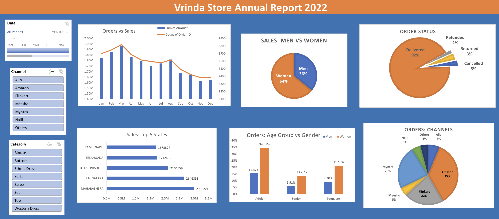

# Vrinda Store Annual Sales Analysis (2022)

## Project Objective
The Vrinda Store wants to create an annual sales report for 2022. The goal is to understand customer behavior and identify sales patterns to drive a strategic growth plan for 2023.

## Dataset Overview
The dataset contains over 31,000 rows of sales data, including customer demographics (age, gender), order details (status, category, size, quantity), and geographical information (city, state).

## Business Questions Addressed
To provide a comprehensive analysis, the project answers the following key questions:
1. **Sales vs. Orders:** Compare total sales and total orders using a single visualization.
2. **Peak Performance:** Which month recorded the highest sales and orders?
3. **Gender Analysis:** Who purchased more between men and women in 2022?
4. **Order Status:** What is the distribution of different order statuses (Delivered, Cancelled, etc.)?
5. **Top States:** Which are the top 5 states contributing most to the annual revenue?
6. **Demographics:** What is the relationship between age and gender regarding order volume?
7. **Channel Analysis:** Which sales channel (Amazon, Flipkart, Myntra, etc.) contributes the maximum sales?
8. **Product Category:** Which category is the highest selling?

## Project Workflow

### 1. Data Cleaning
* Standardized entries in the **Gender** column (converting 'M'/'W' to 'Man'/'Woman').
* Handled missing values and ensured consistent data types for amounts and dates.
* Removed duplicate records to ensure data integrity.

### 2. Data Processing
* **Age Groups:** Created a new column to categorize customers into *Teenager (<18)*, *Adult (18-50)*, and *Senior (>50)* using Excel `IF` functions.
* **Month Extraction:** Extracted month names from order dates using the `TEXT` function for monthly trend analysis.

### 3. Data Analysis & Visualization
* Utilized **Pivot Tables** to aggregate data across various dimensions.
* Developed an **Interactive Dashboard** featuring:
    * **Line Charts** for monthly trends.
    * **Pie/Donut Charts** for gender and channel distribution.
    * **Bar Charts** for state-wise and age-group performance.
    * **Interactive Elements:** Added **Slicers** (Channel, Category) and a **Timeline** to allow dynamic filtering of the entire report.

## Final Insights
* **Target Audience:** Women are the primary customers, accounting for ~65% of total sales.
* **Key Demographics:** The "Adult" age group (30-49 years) is the highest-contributing segment.
* **Top Channels:** Amazon, Flipkart, and Myntra are the leading platforms for orders.
* **Geography:** Maharashtra, Karnataka, and Uttar Pradesh are the top 3 states by revenue.

## Conclusion & Recommendation
To maximize sales in 2023, Vrinda Store should focus marketing efforts on **Women aged 30-49** residing in **Maharashtra, Karnataka, and Uttar Pradesh** by offering platform-specific promotions on **Amazon and Flipkart**.